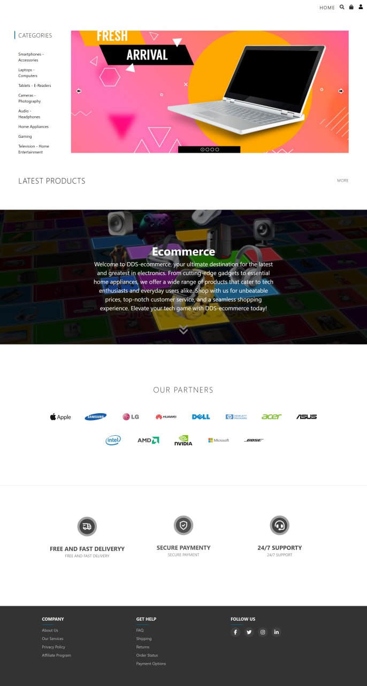
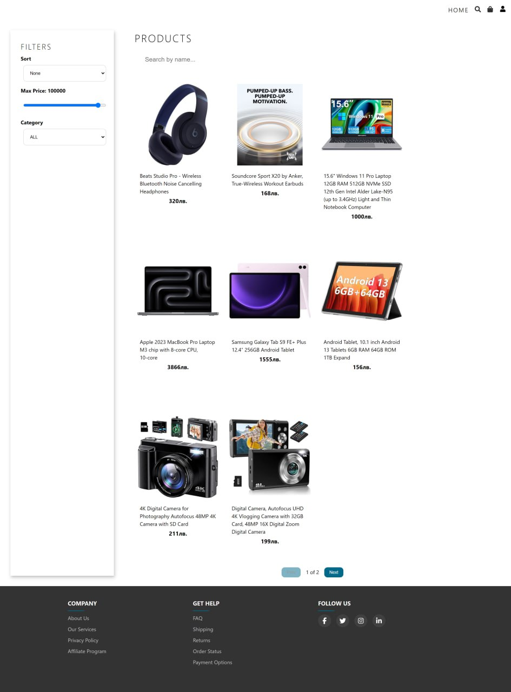
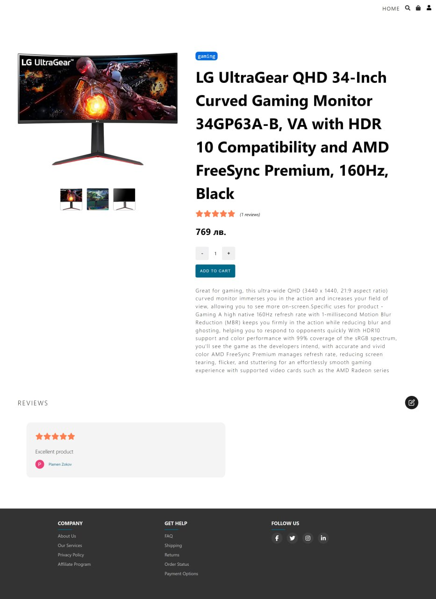
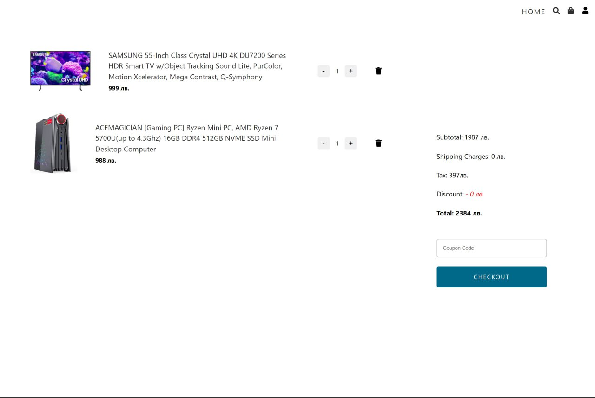
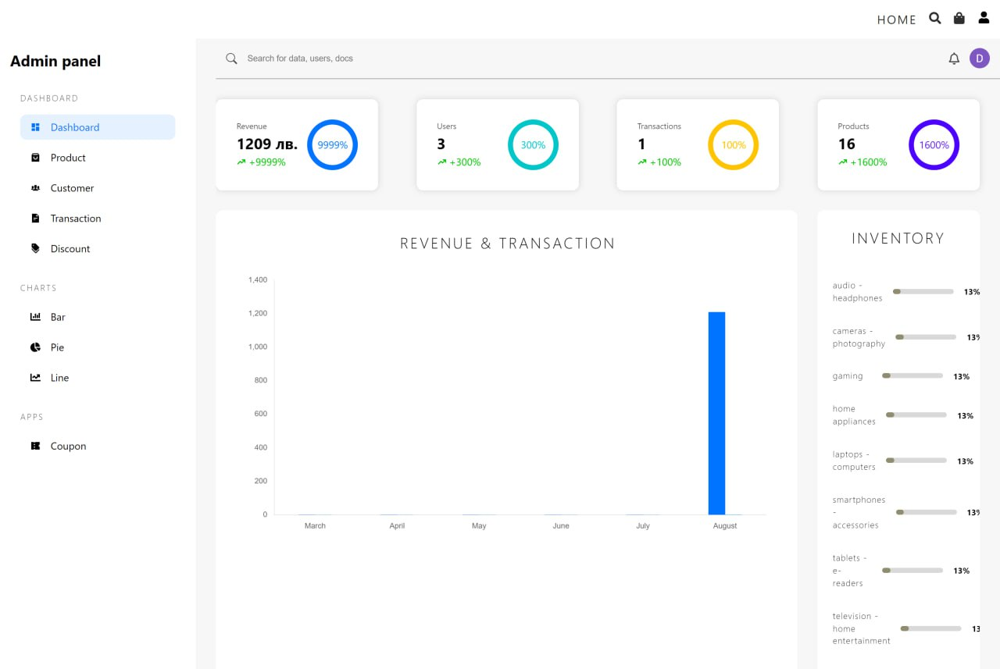
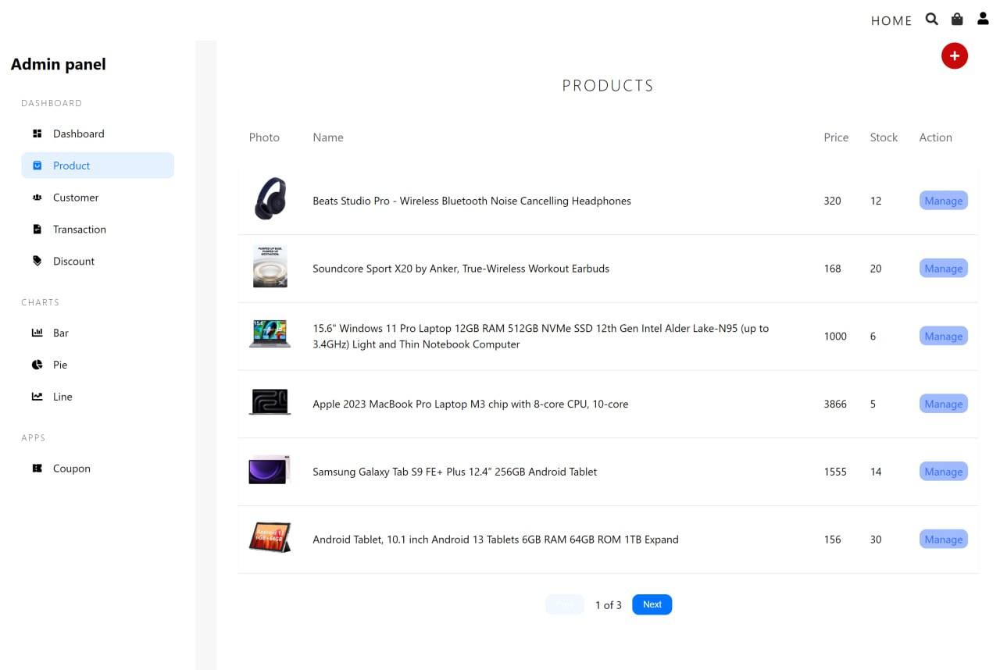
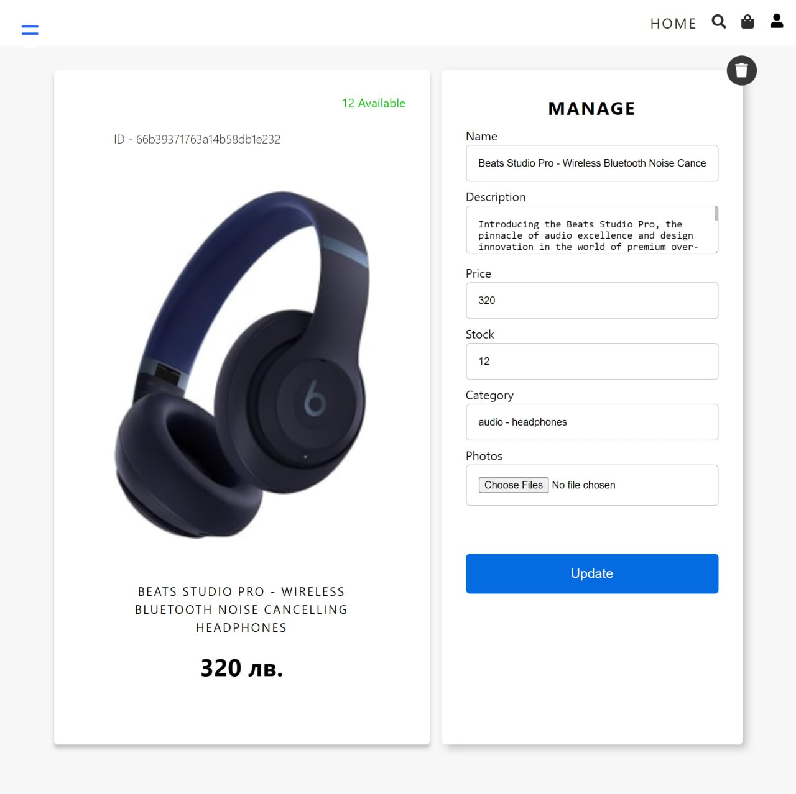

# SoftUni React Project - Electronics ecommerce

## You can view the site here

### Backend deploy in https://render.com/ [Click Me](https://dds-ecommerce-server.onrender.com/)

### Frontend deploy in https://vercel.com/ [Click Me](https://dds-ecommerce-frontend.vercel.app/)

## Table of Contents

1. [Introduction](#introduction)
2. [Technologies used](#technologies-used)
3. [Features](#features)
   - [User Features](#user-features)
   - [Administrator Features](#administrator-features)
4. [Setup-Instructions](#setup-instructions)
5. [Screenshots](#screenshots)

## Introduction

**DDS Ecommerce** is a web application that enables users to find a suitable product for themselves or their acquaintances and make online orders at a time convenient for them. For a better user experience, the products are filtered by category and price. Тhere is an option to search for products by name. And because user opinion is important to us, we provide the opportunity to comment on the products and vote a ratings, which facilitates the choice compared to other users. It supports three types of user: Guest, User and Admin. Guests can browse the products and see the reviews left by users. Registered users have the opportunity to leave a review for a product, give their rating, purchase the products they have ordered, as well as view their orders. Ecommerce admin can add new products, edit and delete them. Additionally the admin can change the order status and add a price discount coupon that can be applied when placing an order. The admin panel displays statistics for orders, users, products and earned profits.

## Technologies used

1. Backend

- Node.js
- Express.js
- MongoDB with Mongoose
- Cloudinary(for upload product images in cloud)
- Typescript

2. Frontend

- React
- Typescript
- Redux
- Redux toolkit
- Stripe
- Firebase(for user authentication)
- SASS

## Features

### Guest Features

- View products
- Register
- Login to the system

### User Features

- View products
- Place an order
- Make a payment
- Ability to add a comment to products, as well as edit/delete those added by them
- Ability to set a rating
- View your orders

### Administrator Features

- Create new products
- Edit and delete already created products
- Order status management
- Create coupons to apply a discount to the bill
- Ability to retrieve statistics for users, orders, products and profits

## Setup-Instructions

1. Clone the repository: https://github.com/RamadanEmin/react_ecommerce.git
2. Backend Configuration: Navigate to the `eccomerce-backend` folder and create `.env` file. Add the following contents in file:

   ```plaintext
   PORT=4000
   MONGO_URI= your Mongo uri
   REDIS_URI= your Redis uri
   CLOUD_NAME= your Cloudinary name
   CLOUD_API_KEY= your Cloudinary Api key
   CLOUD_API_SECRET= your Cloudinary Api secret key
   STRIPE_KEY= your Stripe Api secret key
   CLIENT_URL=http://localhost:5173
   ```
3. Backend Configuration: Navigate to the `eccomerce-frontend` folder and create `.env` file. Add the following contents in file:

   ```plaintext
    VITE_FIREBASE_KEY= your Firebase key
    VITE_AUTH_DOMAIN= your Firebase authentication domain
    VITE_PROJECT_ID= your Firebase project id
    VITE_STORAGE_BUCKET= your Firebase storage bucket
    VITE_MESSAGING_SENDER_ID= your Firebase messaging sender id
    VITE_APP_ID=1:128943591457:web:529062a87fc906d9b79360
    VITE_SERVER=http://localhost:4000
    VITE_STRIPE_KEY= your Stripe public key
   ```
4. Running the Application

**server**: - Navigate to the `eccomerce-backend` directory. - Install dependencies: `npm install`. - Start the server: `npm run dev`.

**client**: - Open a new terminal and navigate to the `eccomerce-frontend` directory. - Install dependencies: `npm install`. - Start the frontend application: `npm run dev`.

# Screenshots

## Home Page



## Catalog



## Product Details



## Cart



## Admin dashboard



## Admin Products add page



## Admin Products manage(edit/delete) page


